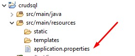
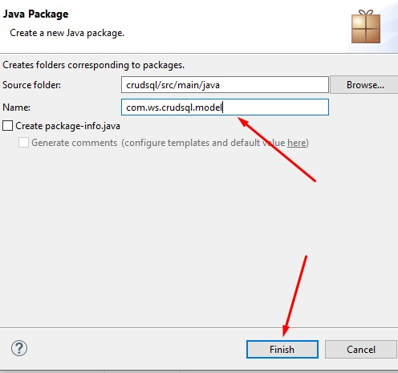
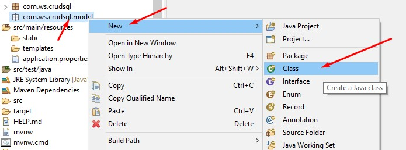
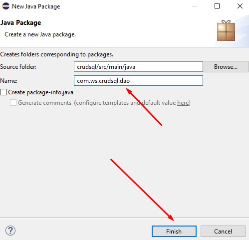
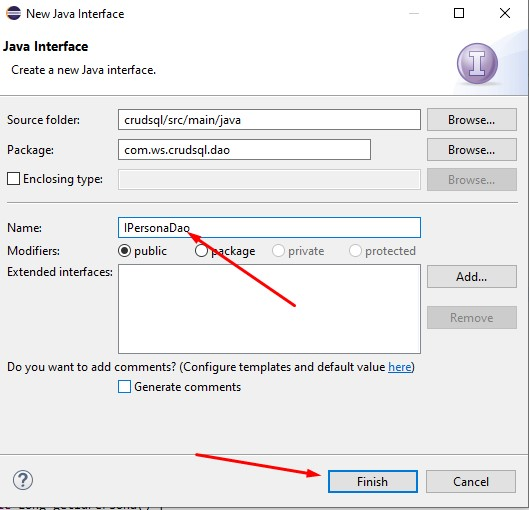

# Jpa y Sql Server
## Tabla de contenidos
- [Introducción](#introducción)
- [Preparar el entorno](#preparar-el-entorno)
- [Importar Proyecto en Eclipse](#importar-proyecto-en-eclipse)
- [Modificamos el archivo application properties](#modificamos-el-archivo-application-propertiess)
- [Creamos el paquete y clase del modelo](#creamos-el-paquete-y-clase-del-modelo)


## Introducción

Con este servicio web podemos crear tablas, realizar CRUD y paginación en Sql Server usando JPA.

## Preparar el entorno

Ingresamos a la web de spring `<link>`: https://start.spring.io/ y procedemos a llenar los siguientes datos:
1. Project: Maven Project
2. Language: Java
3. Spring Boot: 2.33
4. Project Medatada:
    - Group: com.wb `Colocar el nombre de grupo de tu servicio`
    - Artifact: crudsql `Nombre de tu paquete principal`
    - Description: Servicio de jpa con sql `Colocas una breve descripción`
    - Packaing: Jar
    - Java: 8
 5. Dependencies
    - Spring Web
    - Sring Data JPA
    - MS SQL Server Driver
 6. Generar, descargar y descomprimimos el archivo.
 
 ## Importar proyecto en eclipse
 
 1. Abrimos Eclipse
 2. File/Import/Maven/Existing Maven Projects
 3. Buscamos la carpeta de nuestro proyecto descargado
 4. Seleccionamos pom.xml y presionamos finalizar
 
 ## Modificamos el archivo application properties
 
 1. Abrimos el archivo application.properties
 <div align="center">
  
</div>

 2. Ingresamos los siguientes valores
 ```
    server.port=8087 "puerto donde se conectará tu servicio"
    server.servlet.context-path=/wb "nombre de url en este caso es wb"
    spring.jpa.hibernate.ddl-auto=update
    spring.datasource.url=jdbc:sqlserver://localhost;databaseName=BD01 "colocar el nombre de tu base de datos"
    spring.datasource.username=sa "usuario de sql server"
    spring.datasource.password=mypassword "contraseña de sql server"
    spring.datasource.driverClassName=com.microsoft.sqlserver.jdbc.SQLServerDriver
    spring.jpa.show-sql=true
    spring.jpa.hibernate.dialect=org.hibernate.dialect.SQLServer2012Dialect
```
## Creamos el paquete y clase del modelo
1. Creamos el paquete
<div align="center">
  
</div>
2. Le ponemos el nombre del modelo
<div align="center">
  
</div>

3. Creamos la clase "Persona"
<div align="center">
  
</div>

4. Ingresamos el código siguiente:

```java
package com.ws.crudsql.model;
import javax.persistence.Column;
import javax.persistence.Entity;
import javax.persistence.GeneratedValue;
import javax.persistence.GenerationType;
import javax.persistence.Id;
import javax.persistence.Table;

@Entity
@Table(name="tblPersona")
public class Persona {

	@Id
	@GeneratedValue(strategy = GenerationType.IDENTITY)
	private Long idPersona;
	
	@Column(name="nombres", nullable=false, length=50)
	private String nombres;
	
	@Column(name="apellidos", nullable=false, length=50)
	private String apellidos;

	public Long getIdPersona() {
		return idPersona;
	}

	public void setIdPersona(Long idPersona) {
		this.idPersona = idPersona;
	}

	public String getNombres() {
		return nombres;
	}

	public void setNombres(String nombres) {
		this.nombres = nombres;
	}

	public String getApellidos() {
		return apellidos;
	}

	public void setApellidos(String apellidos) {
		this.apellidos = apellidos;
	}

	@Override
	public String toString() {
		return "Persona [idPersona=" + idPersona + ", nombres=" + nombres + ", apellidos=" + apellidos + "]";
	}
	
}

```
##Creamos el paquete Dao y la interfaz

1. Creamos el paquete
<div align="center">
  
</div>
2. Le ponemos el nombre de dao
<div align="center">
  
</div>

3. Creamos la interfaz "IPersonaDao"
<div align="center">
  
</div>
<div align="center">
  
</div>

4. Ingresamos el código siguiente:

```java
package com.ws.crudsql.dao;

import org.springframework.data.jpa.repository.JpaRepository;

import com.ws.crudsql.model.Persona;

public interface IPersonaDao extends JpaRepository<Persona, Long> {

}
```


 
 
 
    

   
