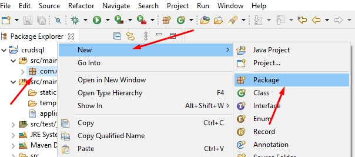
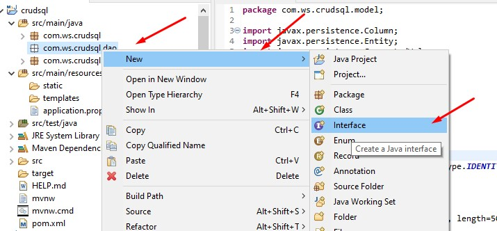

# Jpa y Sql Server
## Tabla de contenidos
- [Introducción](#introducción)
- [Preparar el entorno](#preparar-el-entorno)
- [Importar Proyecto en Eclipse](#importar-proyecto-en-eclipse)
- [Modificamos el archivo application properties](#modificamos-el-archivo-application-propertiess)
- [Creamos el paquete y clase del modelo](#creamos-el-paquete-y-clase-del-modelo)
- [Creamos el paquete Dao y su interfaz](#creamos-el-paquete-dao-y-su-interfaz)
- [Creamos el paquete Service y su interfaz](#creamos-el-paquete-service-y-su-interfaz)
- [Creamos paquete Controller y su clase](#creamos-paquete-controller-y-su-clase)


## Introducción

Con este servicio web podemos crear tablas, realizar CRUD y paginación en Sql Server usando JPA.

## Preparar el entorno

Ingresamos a la web de spring `<link>`: https://start.spring.io/ y procedemos a llenar los siguientes datos:
1. Project: Maven Project
2. Language: Java
3. Spring Boot: 2.33
4. Project Medatada:
    - Group: com.wb `Colocar el nombre de grupo de tu servicio`
    - Artifact: crudsql `Nombre de tu paquete principal`
    - Description: Servicio de jpa con sql `Colocas una breve descripción`
    - Packaing: Jar
    - Java: 8
 5. Dependencies
    - Spring Web
    - Sring Data JPA
    - MS SQL Server Driver
 6. Generar, descargar y descomprimimos el archivo.
 
 ## Importar proyecto en eclipse
 
 1. Abrimos Eclipse
 2. File/Import/Maven/Existing Maven Projects
 3. Buscamos la carpeta de nuestro proyecto descargado
 4. Seleccionamos pom.xml y presionamos finalizar
 
 ## Modificamos el archivo application properties
 
 1. Abrimos el archivo application.properties
 <div align="center">
  
</div>

 2. Ingresamos los siguientes valores
 ```
    server.port=8087 "puerto donde se conectará tu servicio"
    server.servlet.context-path=/wb "nombre de url en este caso es wb"
    spring.jpa.hibernate.ddl-auto=update
    spring.datasource.url=jdbc:sqlserver://localhost;databaseName=BD01 "colocar el nombre de tu base de datos"
    spring.datasource.username=sa "usuario de sql server"
    spring.datasource.password=mypassword "contraseña de sql server"
    spring.datasource.driverClassName=com.microsoft.sqlserver.jdbc.SQLServerDriver
    spring.jpa.show-sql=true
    spring.jpa.hibernate.dialect=org.hibernate.dialect.SQLServer2012Dialect
```
## Creamos el paquete y clase del modelo
1. Creamos el paquete
<div align="center">
  
</div>
2. Le ponemos el nombre del modelo
<div align="center">
  
</div>

3. Creamos la clase "Persona"
<div align="center">
  
</div>

4. Ingresamos el código siguiente:

```java
package com.ws.crudsql.model;
import javax.persistence.Column;
import javax.persistence.Entity;
import javax.persistence.GeneratedValue;
import javax.persistence.GenerationType;
import javax.persistence.Id;
import javax.persistence.Table;

@Entity
@Table(name="tblPersona")
public class Persona {

	@Id
	@GeneratedValue(strategy = GenerationType.IDENTITY)
	private Long idPersona;
	
	@Column(name="nombres", nullable=false, length=50)
	private String nombres;
	
	@Column(name="apellidos", nullable=false, length=50)
	private String apellidos;

	public Long getIdPersona() {
		return idPersona;
	}

	public void setIdPersona(Long idPersona) {
		this.idPersona = idPersona;
	}

	public String getNombres() {
		return nombres;
	}

	public void setNombres(String nombres) {
		this.nombres = nombres;
	}

	public String getApellidos() {
		return apellidos;
	}

	public void setApellidos(String apellidos) {
		this.apellidos = apellidos;
	}

	@Override
	public String toString() {
		return "Persona [idPersona=" + idPersona + ", nombres=" + nombres + ", apellidos=" + apellidos + "]";
	}
	
}

```
## Creamos el paquete Dao y su interfaz

1. Creamos el paquete
<div align="center">
  
</div>
2. Le ponemos el nombre de dao
<div align="center">
  
</div>

3. Creamos la interfaz "IPersonaDao"
<div align="center">
  
</div>

Ponemos nombre a la interfaz
<div align="center">
  
</div>

4. Ingresamos el código siguiente:

```java
package com.ws.crudsql.dao;

import org.springframework.data.jpa.repository.JpaRepository;

import com.ws.crudsql.model.Persona;

public interface IPersonaDao extends JpaRepository<Persona, Long> {

}
```
## Creamos el paquete Service y su interfaz
1. Creamos el paquete
<div align="center">
  
</div>
2. Le ponemos el nombre de Service
<div align="center">
  
</div>
3. Creamos la interfaz "IPersonaService"
<div align="center">
  
</div>

Ponemos nombre a la interfaz
<div align="center">
  
</div>

4. Ingresamos el código siguiente:
```java
package com.ws.crudsql.service;

import java.util.List;
import org.springframework.data.domain.Page;
import org.springframework.data.domain.Pageable;
import com.ws.crudsql.model.Persona;

public interface IPersonaService {

	Persona registrar(Persona t);
	
	Persona modificar(Persona t);

	boolean eliminar(Long id);

	Persona listarId(Long id);

	List<Persona> listar();
	
	Page<Persona> listarPageable(Pageable pageable);
	
}

```
5. Creamos clase "PresonaServiceImpl"
 
<div align="center">
  
</div>

Ponemos el nombre
<div align="center">
  
</div>
	
Ingresamos el siguiente codigo:	
```java
package com.ws.crudsql.service;

import java.util.List;
import java.util.Optional;
import org.springframework.beans.factory.annotation.Autowired;
import org.springframework.data.domain.Page;
import org.springframework.data.domain.Pageable;
import org.springframework.stereotype.Service;
import com.ws.crudsql.dao.IPersonaDao;
import com.ws.crudsql.model.Persona;

// Ctrl + 1 --> para implementar los metodos de la interfaz
@Service
public class PersonaServiceImpl implements IPersonaService {

	@Autowired
	private IPersonaDao personaDao;
	
	@Override
	public Persona registrar(Persona t) {
		System.out.println(t.toString());
		return personaDao.save(t);
	}

	@Override
	public Persona modificar(Persona t) {
		return personaDao.save(t);
	}

	@Override
	public boolean eliminar(Long id) {
	 Optional<Persona> _p = personaDao.findById(id);
		if(_p != null) {
			personaDao.delete(_p.get());
			return true;
		}
		return false;
	}

	@Override
	public Persona listarId(Long id) {
		return personaDao.findById(id).get();
	}

	@Override
	public List<Persona> listar() {
		return personaDao.findAll();
	}

	@Override
	public Page<Persona> listarPageable(Pageable pageable) {
		return personaDao.findAll(pageable);
	}

}

```
## Creamos paquete Controller y su clase

1. Creamos el paquete
<div align="center">
  
</div>

2. Le ponemos el nombre de Controller
<div align="center">
  
</div>

3. Creamos una clase PersonaController
<div align="center">
  
</div>

4. Ingresamos el siguiente codigo:

```java
package com.ws.crudsql.controller;

import java.io.IOException;
import java.util.ArrayList;
import java.util.List;
import org.springframework.beans.factory.annotation.Autowired;
import org.springframework.data.domain.Page;
import org.springframework.data.domain.Pageable;
import org.springframework.http.HttpStatus;
import org.springframework.http.ResponseEntity;
import org.springframework.web.bind.annotation.DeleteMapping;
import org.springframework.web.bind.annotation.GetMapping;
import org.springframework.web.bind.annotation.PathVariable;
import org.springframework.web.bind.annotation.PostMapping;
import org.springframework.web.bind.annotation.PutMapping;
import org.springframework.web.bind.annotation.RequestBody;
import org.springframework.web.bind.annotation.RequestMapping;
import org.springframework.web.bind.annotation.RestController;
import com.ws.crudsql.model.Persona;
import com.ws.crudsql.service.IPersonaService;

@RestController
@RequestMapping("/personas")
public class PersonaController {

	@Autowired
	private IPersonaService service;
	
	@GetMapping
	public ResponseEntity<List<Persona>>  listar() throws IOException
	{
		List<Persona> lista =service.listar();  //null;
		if(lista == null) {
			lista = new ArrayList<>();
			//throw new IOException("Error al listar");
		}
		return new ResponseEntity<>(lista, HttpStatus.OK);
		
	}
	
	@GetMapping(value="listar/{id}")
	public ResponseEntity<Persona>  listarID(@PathVariable("id") Long id) throws IOException
	{
		Persona _p =service.listarId(id);
		if(_p == null) {
			_p = new Persona();
			//throw new IOException("Error al obtener persona");
		}
		return new ResponseEntity<>(_p, HttpStatus.OK);
		
	}
	
	@GetMapping(value="paginar")
	public ResponseEntity<Page<Persona>> pageable(Pageable pageable){
		Page<Persona> personas;
		personas = service.listarPageable(pageable);
		return new ResponseEntity<>(personas, HttpStatus.OK);
	}
	
	
	
	@PostMapping(value="crear")
	public ResponseEntity<Persona> save(@RequestBody Persona p)
	{
		System.out.println(p.toString());
		Persona _p = service.registrar(p);
		if(_p == null)
			return new ResponseEntity<Persona>(HttpStatus.BAD_REQUEST);
		
		return new ResponseEntity<>(_p, HttpStatus.CREATED);
	}
	
	@PutMapping(value="actualizar")
	public ResponseEntity<Persona> update(@RequestBody Persona p)
	{
		
		Persona _p = service.modificar(p);
		if(_p == null)
			return new ResponseEntity<Persona>(HttpStatus.BAD_REQUEST);
		
		return new ResponseEntity<>(_p, HttpStatus.OK);
	}
	
	@DeleteMapping(value="eliminar/{id}")
	public boolean delete(@PathVariable("id") Long id)
	{
		
		return service.eliminar(id);
	
	}

}

```

Listo ahora solo tienes que probarlo con Postman
 
 
 
    

   
